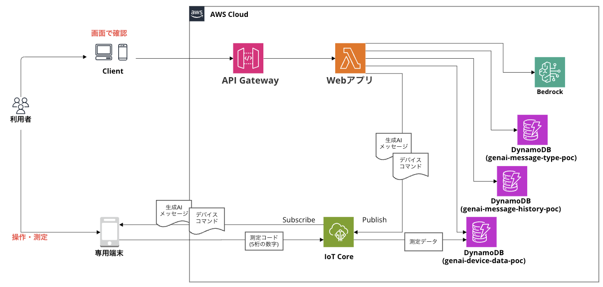

# ドキュメント

## 設計書

- [API 設計とシーケンス図](./api_spec.md)

Visual Studio Code に [Markdown Previe Mermaid Support] を追加してプレビューしてください。

## AWS システム構成図

## AWS リソース

- [DynamoDB](./AWS/DynamoDB.md)
- [IAM](./AWS/IAM.md)
- [IoT](./AWS/IoT.md)
