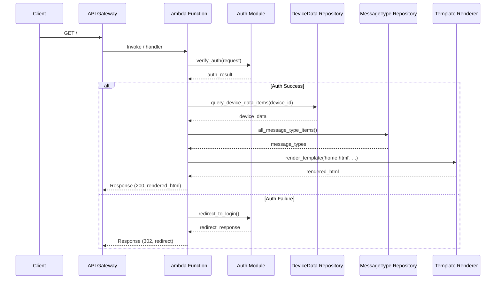
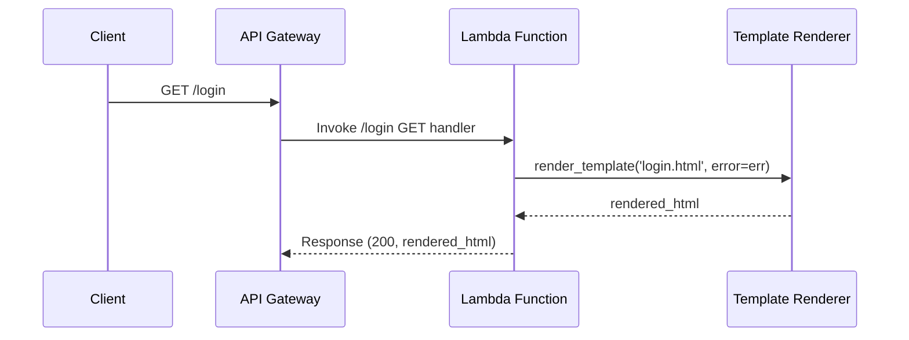
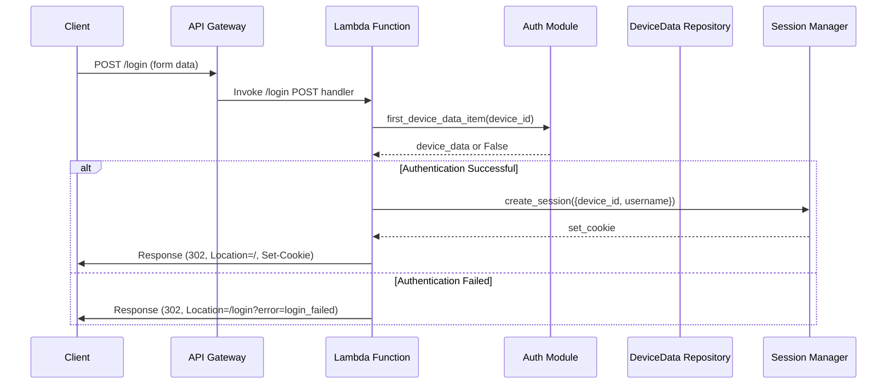
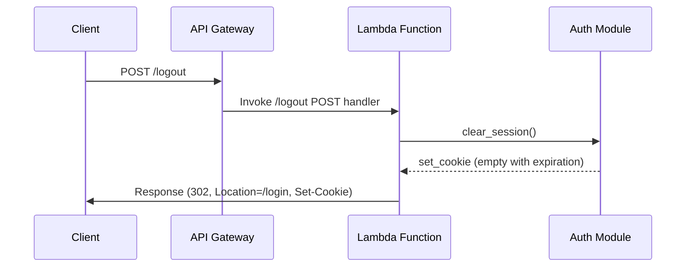
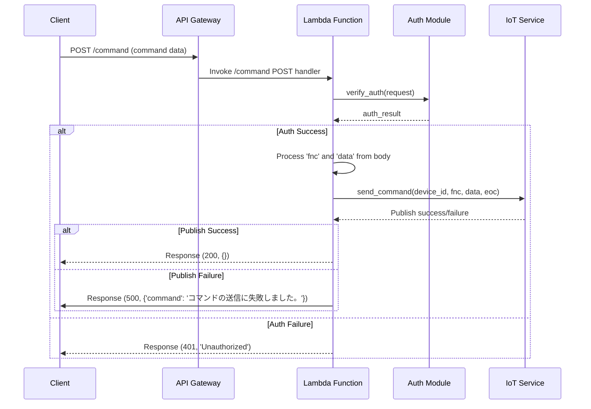
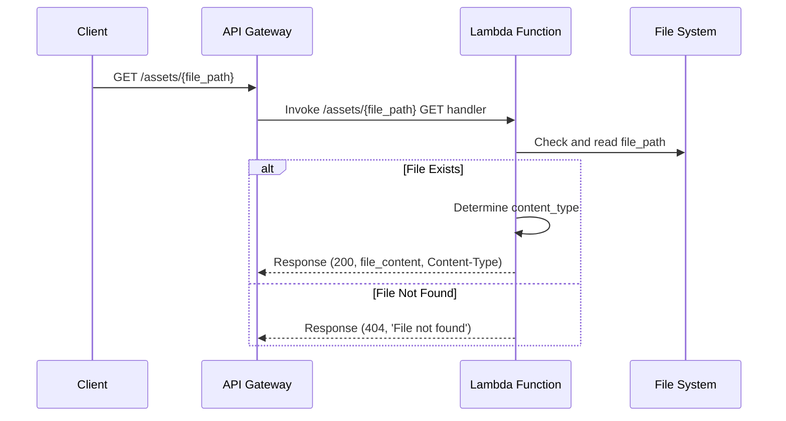
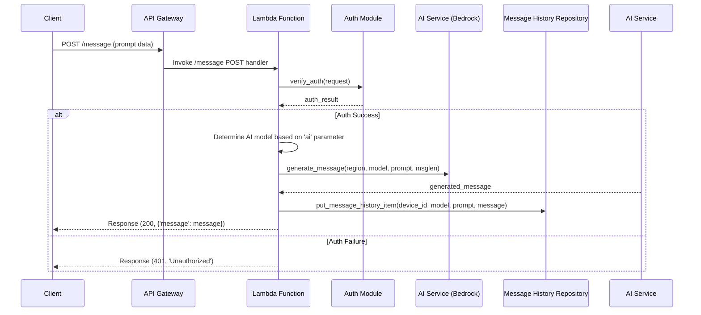

# API 仕様

## ホームページ API

### API 概要

- **メソッド:** GET
- **パス:** `/`
- **説明:** ユーザーの認証を検証し、DynamoDB からデバイスデータおよびメッセージタイプを取得してホームページをレンダリングします。

### Mermaid シーケンス図

### 詳細設計書

#### 目的

ホームページ API は、認証されたユーザーに対してメインインターフェースを提供し、デバイスデータやメッセージタイプを表示します。ユーザーが他の機能と対話できるようにするための画面を提供します。

#### インプット

- **リクエストメソッド:** GET
- **パスパラメータ:** なし
- **ヘッダー:**
  - **Cookie:** セッション情報を含む。

#### アウトプット

- **成功時:**

  - **ステータスコード:** 200 OK
  - **Content-Type:** text/html;charset=utf-8
  - **ボディ:** レンダリングされたホームページの HTML コンテンツ。

- **認証失敗時:**
  - **ステータスコード:** 302 Found
  - **ヘッダー:**
    - **Location:** /login
  - **ボディ:** なし

#### フロー

1. **認証検証:**

   - リクエストヘッダーからセッション Cookie を取得。
   - `verify_auth(request)`を呼び出してセッションを検証。
   - 認証に失敗した場合、ログインページへのリダイレクト応答を生成。

2. **データ取得:**

   - 認証に成功した場合、セッションから`device_id`と`username`を取得。
   - `query_device_data_items(device_id)`を呼び出してデバイスデータを DynamoDB から取得。
   - `all_message_type_items()`を呼び出してメッセージタイプを DynamoDB から取得。

3. **テンプレートレンダリング:**

   - `render_template('home.html', ...)`を呼び出して HTML テンプレートをデータでレンダリング。

4. **応答生成:**
   - レンダリングされた HTML を含む 200 ステータスのレスポンスをクライアントに返却。

#### 依存関係

- **Auth Module (`verify_auth`):** ユーザーの認証を管理。
- **DeviceData Repository (`query_device_data_items`):** DynamoDB からデバイスデータを取得。
- **MessageType Repository (`all_message_type_items`):** DynamoDB からメッセージタイプを取得。
- **Template Renderer (`render_template`):** HTML テンプレートをレンダリング。

## ログインページ API

### API 概要

- **メソッド:** GET
- **パス:** `/login`
- **説明:** ログインページをレンダリングします。ログイン失敗時にはエラーメッセージを表示します。

### Mermaid シーケンス図

### 詳細設計書

#### 目的

ログインページ API は、ユーザーに対してログインフォームを提供し、認証の開始点として機能します。ログイン失敗時にはエラーメッセージを表示することで、ユーザーに適切なフィードバックを提供します。

#### インプット

- **リクエストメソッド:** GET
- **パスパラメータ:** なし
- **クエリパラメータ:** `error`（オプション） - ログイン失敗を示すために使用。

#### アウトプット

- **成功時:**
  - **ステータスコード:** 200 OK
  - **Content-Type:** text/html;charset=utf-8
  - **ボディ:** レンダリングされたログインページの HTML コンテンツ。

#### フロー

1. **エラーハンドリング:**

   - クエリパラメータに`error`が含まれているかを確認し、ログイン失敗時のメッセージを表示。

2. **テンプレートレンダリング:**

   - `render_template('login.html', error=err)`を呼び出して HTML テンプレートをレンダリング。

3. **応答生成:**
   - レンダリングされた HTML を含む 200 ステータスのレスポンスをクライアントに返却。

#### 依存関係

- **Template Renderer (`render_template`):** 'login.html'テンプレートをレンダリング。

## ログイン API

### API 概要

- **メソッド:** POST
- **パス:** `/login`
- **説明:** ログインフォームの送信を処理し、ユーザーの認証を行います。認証に成功した場合、セッションを作成しホームページへリダイレクトします。失敗した場合はログインページへエラーメッセージ付きでリダイレクトします。

### Mermaid シーケンス図

### 詳細設計書

#### 目的

ログイン送信 API は、ユーザーが入力した認証情報を基に認証を行い、成功時にはセッションを作成してホームページへリダイレクトし、失敗時にはログインページにエラーメッセージを表示します。

#### インプット

- **リクエストメソッド:** POST
- **パスパラメータ:** なし
- **ヘッダー:**
  - **Content-Type:** application/x-www-form-urlencoded
- **ボディパラメータ:**
  - **device_id:** デバイスの識別子。
  - **username:** ユーザー名。
  - **password:** パスワード（コードではコメントアウトされており、未実装）。

#### アウトプット

- **成功時:**

  - **ステータスコード:** 302 Found
  - **ヘッダー:**
    - **Location:** `/`（ホームページ）
    - **Set-Cookie:** セッション情報を含む Cookie。
  - **ボディ:** なし

- **失敗時:**
  - **ステータスコード:** 302 Found
  - **ヘッダー:**
    - **Location:** `/login?error=login_failed`
  - **ボディ:** なし

#### フロー

1. **リクエスト解析:**

   - フォームデータから`device_id`と`username`を抽出。
   - パスワードフィールドは現在未実装。

2. **認証処理:**

   - `first_device_data_item(device_id)`を呼び出してデバイスの存在を確認。
   - パスワードの検証が必要な場合、ここに実装する予定。

3. **セッション作成:**

   - 認証に成功した場合、`create_session`を呼び出してセッション Cookie を生成。
   - `httponly`、`secure`、`samesite=Strict`属性を設定。

4. **リダイレクト処理:**
   - 成功時はホームページへリダイレクト。
   - 失敗時はログインページへエラーメッセージ付きでリダイレクト。

#### 依存関係

- **Auth Module (`first_device_data_item`, `create_session`):** 認証ロジックとセッション管理を担当。
- **DeviceData Repository:** DynamoDB とのやり取りを行い、デバイス情報を検証。

## ログアウト API

### API 概要

- **メソッド:** POST
- **パス:** `/logout`
- **説明:** ユーザーのセッションをクリアし、ログインページへリダイレクトします。

### Mermaid シーケンス図

### 詳細設計書

#### 目的

ログアウト API は、ユーザーセッションを安全に終了させ、再度の認証を要求することで、セキュリティを維持します。セッション情報をクリアし、ユーザーをログインページへリダイレクトします。

#### インプット

- **リクエストメソッド:** POST
- **パスパラメータ:** なし
- **ヘッダー:**
  - **Cookie:** クリア対象のセッション情報を含む。

#### アウトプット

- **レスポンス:**
  - **ステータスコード:** 302 Found
  - **ヘッダー:**
    - **Location:** `/login`
    - **Set-Cookie:** セッション Cookie を空に設定し、期限切れにする。
  - **ボディ:** なし

#### フロー

1. **セッションクリア:**

   - `clear_session()`を呼び出し、セッション Cookie を空にし、過去の日時を設定して期限切れにする。

2. **リダイレクト処理:**
   - クライアントをログインページへリダイレクト。

#### 依存関係

- **Auth Module (`clear_session`):** セッションのクリア処理を担当。

## コマンド送信 API

### API 概要

- **メソッド:** POST
- **パス:** `/command`
- **説明:** 認証されたユーザーが指定したコマンドを指定のデバイスに送信します。AWS IoT を利用してコマンドをデバイスの MQTT トピックにパブリッシュします。

### Mermaid シーケンス図

### 詳細設計書

#### 目的

コマンド送信 API は、認証されたユーザーが指定したコマンドをデバイスに送信するためのインターフェースを提供します。AWS IoT を利用してコマンドをパブリッシュし、デバイスとの通信を実現します。

#### インプット

- **リクエストメソッド:** POST
- **パスパラメータ:** なし
- **ヘッダー:**
  - **Cookie:** 認証情報を含む。
- **ボディパラメータ:**
  - **fnc:** コマンドの種類を示す文字列（例: 'cde', 'msg', 'mnu'）。
  - **menu:** メニューコードを示す文字列。先頭をゼロ埋めして 2 文字にする。
  - **mmcodes:** （オプション）測定コードのリスト。`fnc`が 'cde' の場合に必要。
  - **message:** （オプション）メッセージ内容。`fnc`が 'msg' の場合に必要。

#### アウトプット

- **成功時:**

  - **ステータスコード:** 200 OK
  - **Content-Type:** application/json
  - **ボディ:** 空の JSON オブジェクト `{}`

- **認証失敗時:**

  - **ステータスコード:** 401 Unauthorized
  - **ボディ:** 'Unauthorized'

- **コマンド送信失敗時:**
  - **ステータスコード:** 500 Internal Server Error
  - **Content-Type:** application/json
  - **ボディ:** `{'command': 'コマンドの送信に失敗しました。'}`

#### フロー

1. **認証検証:**

   - セッション情報を抽出し、`verify_auth(request)`を呼び出して認証を検証。
   - 認証に失敗した場合、401 レスポンスを返却。

2. **コマンド処理:**

   - リクエストボディから`fnc`と`menu`を抽出。
   - `menu`を 2 文字にゼロ埋め。

3. **コマンドデータのフォーマット:**

   - `fnc`の種類に応じて、`data`を生成。
     - `'cde'`: `menu`と全ての`mmcodes`を結合。
     - `'msg'`: `menu`と固定文字列 'HELLO' を結合。
     - `'mnu'`: `menu`をそのまま使用。
     - 不明な`fnc`の場合、`data`を空文字に設定。

4. **コマンド送信:**

   - `send_command(device_id, fnc, data, '?')`を呼び出して、AWS IoT の MQTT トピックにコマンドをパブリッシュ。

5. **レスポンス処理:**
   - コマンド送信に成功した場合、200 レスポンスを返却。
   - 失敗した場合、エラーメッセージとともに 500 レスポンスを返却。

#### 依存関係

- **Auth Module (`verify_auth`):** リクエストの認証を管理。
- **IoT Service (`send_command`):** AWS IoT にコマンドをパブリッシュ。

## 静的アセット提供 API

### API 概要

- **メソッド:** GET
- **パス:** `/assets/{file_path}`
- **説明:** JavaScript や CSS などの静的アセットファイルを提供します。指定された`file_path`が存在することを確認し、適切なコンテンツタイプでレスポンスを返します。

### Mermaid シーケンス図

### 詳細設計書

#### 目的

静的アセット提供 API は、フロントエンドの JavaScript や CSS ファイル、その他の静的リソースをクライアントに提供します。これにより、ユーザーインターフェースの動的な機能やスタイルがサポートされます。

#### インプット

- **リクエストメソッド:** GET
- **パスパラメータ:**
  - **file_path:** 提供するファイルの相対パス。

#### アウトプット

- **成功時:**

  - **ステータスコード:** 200 OK
  - **Content-Type:** ファイル拡張子に基づく適切なタイプ（例: `.js` → `application/javascript`）
  - **ボディ:** リクエストされたファイルのバイナリコンテンツ。

- **失敗時（ファイル未存在）:**
  - **ステータスコード:** 404 Not Found
  - **ボディ:** 'File not found'

#### フロー

1. **ファイルパスの解決:**

   - リクエストされた`file_path`とアセットディレクトリを結合して、実際のファイルパスを構築。

2. **ファイルの存在確認:**

   - `os.path.isfile(asset_path)`を使用してファイルの存在を確認。

3. **ファイル提供:**

   - ファイルが存在する場合、バイナリモードでファイルを読み込む。
   - ファイル拡張子に基づいて`Content-Type`を決定。
   - 読み込んだファイル内容を適切なヘッダーとともにクライアントに返却。

4. **エラーハンドリング:**
   - ファイルが存在しない場合、404 ステータスとともにエラーメッセージを返却。

#### 依存関係

- **ファイルシステムアクセス:** アセットディレクトリ内のファイルにアクセス。
- **OS モジュール:** パス操作やファイル存在確認を行う。

#### パフォーマンスの考慮点

- **キャッシングヘッダーの追加:** クライアント側のキャッシュを有効にするために、`Cache-Control`や`ETag`ヘッダーを追加することを検討。
- **CDN の活用:** 静的アセットを AWS CloudFront などの CDN 経由で提供することで、パフォーマンスとスケーラビリティを向上。

## メッセージ生成 API

### API 概要

- **メソッド:** POST
- **パス:** `/message`
- **説明:** ユーザーのプロンプトに基づいて指定された AI モデル（AWS Bedrock）を使用してメッセージを生成し、生成されたメッセージをメッセージ履歴として保存します。

### Mermaid シーケンス図

### 詳細設計書

#### 目的

メッセージ生成 API は、ユーザーからのプロンプトを基に指定された AI モデル（AWS Bedrock）を利用してメッセージを生成し、生成されたメッセージを履歴として保存します。これにより、動的なコンテンツ生成とユーザーとのインタラクションの強化を実現します。

#### インプット

- **リクエストメソッド:** POST
- **パスパラメータ:** なし
- **ヘッダー:**
  - **Cookie:** 認証情報を含む。
- **ボディパラメータ:**
  - **ai:** 使用する AI モデルを示す文字列（例: 'bedrock/claude3-haiku'）。
  - **msglen:** 生成されるメッセージの長さを指定する整数。
  - **prompt:** ユーザーが入力したプロンプト文字列。

#### アウトプット

- **成功時:**

  - **ステータスコード:** 200 OK
  - **Content-Type:** application/json
  - **ボディ:** `{'message': generated_message}`

- **認証失敗時:**

  - **ステータスコード:** 401 Unauthorized
  - **ボディ:** 'Unauthorized'

- **AI 生成失敗時:**
  - **ステータスコード:** 400 Bad Request または 500 Internal Server Error
  - **Content-Type:** application/json
  - **ボディ:** `{'message': 'AIのメッセージ生成に失敗しました。'}`

#### フロー

1. **認証検証:**

   - セッション情報を抽出し、`verify_auth(request)`を呼び出して認証を検証。
   - 認証に失敗した場合、401 レスポンスを返却。

2. **AI モデル選択:**

   - リクエストボディから`ai`パラメータを基に使用する AI モデルとリージョンを決定。

3. **メッセージ生成:**

   - `generate_message(region, model, prompt, msglen)`を呼び出して、指定された AI モデルを使用してメッセージを生成。

4. **メッセージ履歴の保存:**

   - 生成されたメッセージと関連情報（`device_id`, `model`, `prompt`）を`put_message_history_item`を介して DynamoDB に保存。

5. **レスポンス生成:**

   - 生成されたメッセージを含む 200 ステータスのレスポンスをクライアントに返却。

6. **エラーハンドリング:**
   - AI モデルの選択やメッセージ生成に失敗した場合、適切なエラーレスポンスを返却。

#### 依存関係

- **Auth Module (`verify_auth`):** リクエストの認証を管理。
- **AI Service (`generate_message`):** AWS Bedrock を介してメッセージを生成。
- **Message History Repository (`put_message_history_item`):** 生成されたメッセージを DynamoDB に保存。
