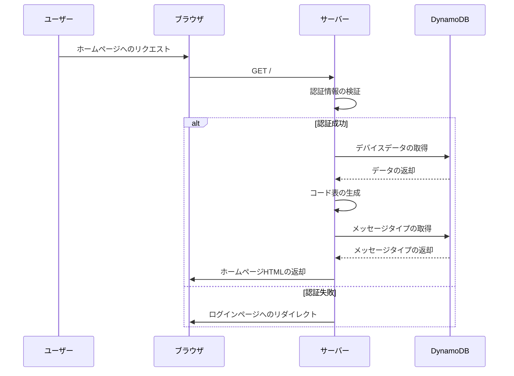
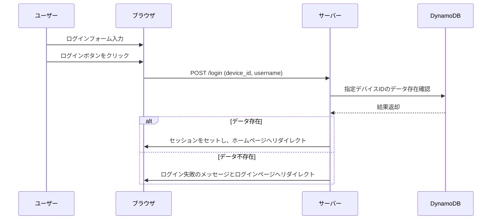
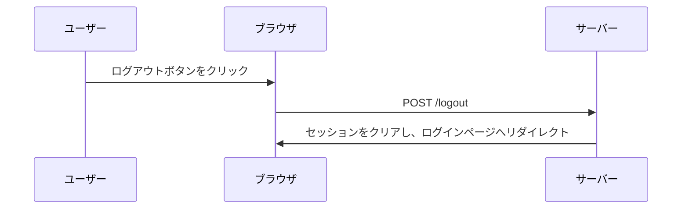
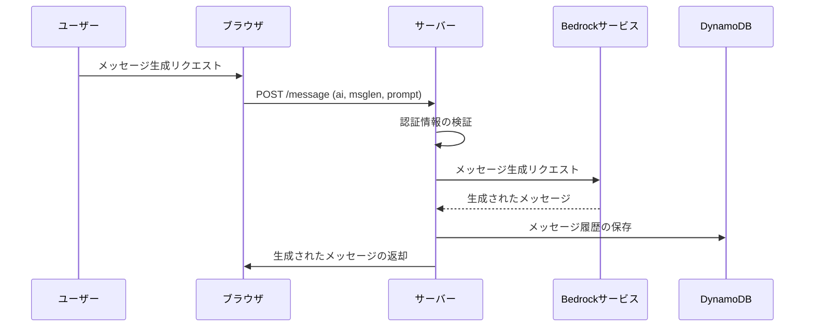
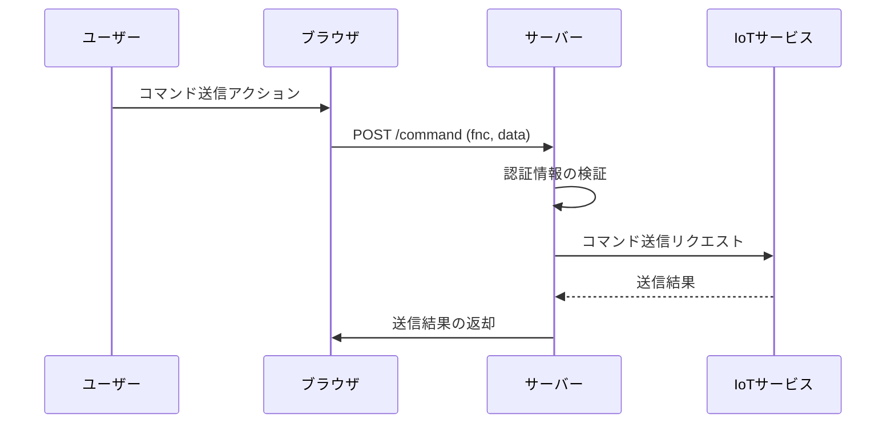
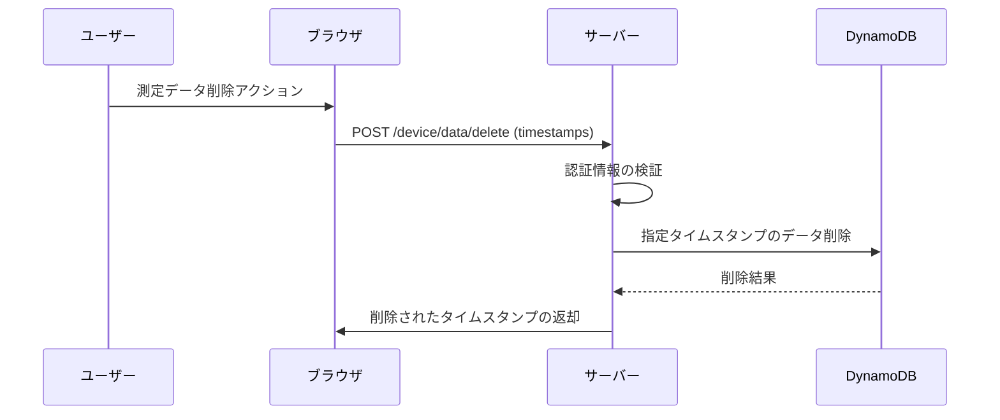
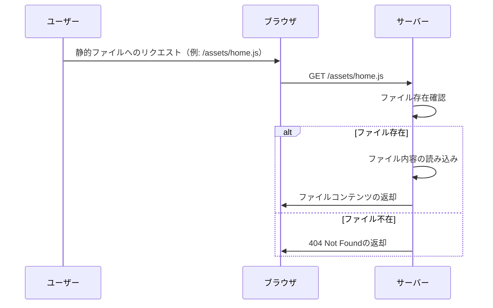
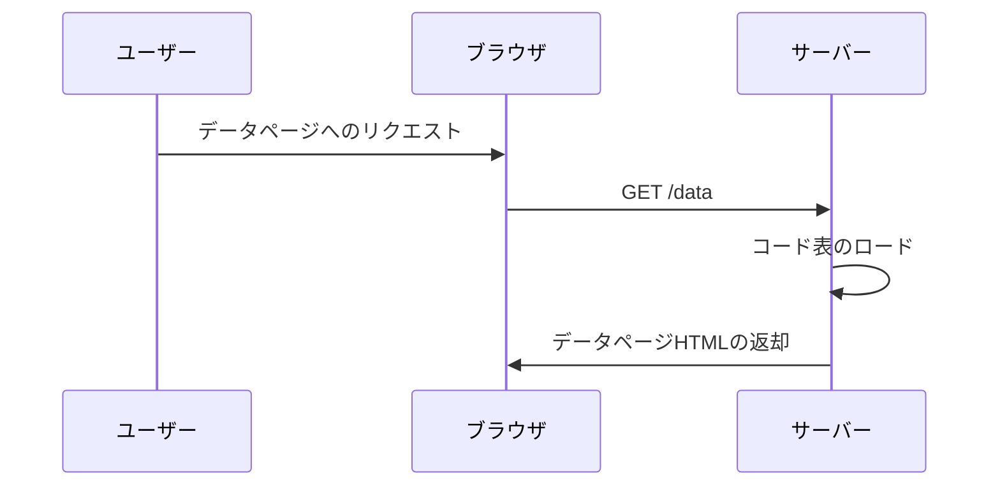
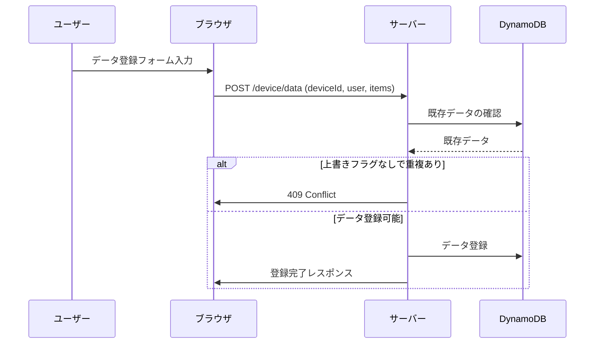

# API 設計とシーケンス図

## 1. ホームページ表示 API (`/`)

### シーケンス図



### 詳細設計

#### エンドポイント

- **URL:** `/`
- **メソッド:** `GET`
- **目的:** ホームページを表示し、認証されたユーザーのデバイスデータを表示する。

#### リクエスト

- **ヘッダー:**
  - `Cookie: session=...`  
    ユーザーのセッション情報が含まれています。

#### レスポンス

- **認証成功時:**

  - **ステータスコード:** `200 OK`
  - **ヘッダー:** `Content-Type: text/html; charset=utf-8`
  - **ボディ:** `home.html`テンプレートにレンダリングされた HTML。

- **認証失敗時:**
  - **ステータスコード:** `302 Found`
  - **ヘッダー:** `Location: /login`
  - **ボディ:** 空

#### 処理の流れ

1. **ユーザーがホームページにアクセス。**
2. **サーバーがセッション情報を検証。**
   - 有効なセッションがある場合:
     - DynamoDB からデバイスデータを取得。
     - データを基に必要なコード表（メニュー、モード、測定コード）を生成。
     - DynamoDB からメッセージタイプを取得。
     - 取得したデータを`home.html`テンプレートに埋め込み、HTML を生成。
     - ブラウザに HTML を返却。
   - 無効なセッションの場合:
     - ログインページへリダイレクト。

---

## 2. ログイン API (`/login`)

### シーケンス図



### 詳細設計

#### エンドポイント

- **URL:** `/login`
- **メソッド:** `GET`, `POST`
- **目的:** ユーザーの認証を行い、セッションを作成する。

#### リクエスト

- **GET `/login`:**

  - **目的:** ログインページを表示する。
  - **リクエスト:** 特になし。

- **POST `/login`:**
  - **ヘッダー:**
    - `Content-Type: application/x-www-form-urlencoded`
  - **ボディ:**
    - `device_id` (文字列): デバイスの識別子。
    - `username` (文字列): ユーザー名。
    - `password` (文字列): 現在は未使用（コメントアウトされている）。

#### レスポンス

- **GET `/login`:**

  - **ステータスコード:** `200 OK`
  - **ヘッダー:** `Content-Type: text/html; charset=utf-8`
  - **ボディ:** `login.html`テンプレートにレンダリングされた HTML。

- **POST `/login`:**
  - **認証成功時:**
    - **ステータスコード:** `302 Found`
    - **ヘッダー:**
      - `Location: /`
      - `Set-Cookie: session=...; HttpOnly; Secure; SameSite=Strict`
    - **ボディ:** 空
  - **認証失敗時:**
    - **ステータスコード:** `302 Found`
    - **ヘッダー:**
      - `Location: /login?error=login_failed`
    - **ボディ:** 空

#### 処理の流れ

1. **ユーザーがログインページにアクセス。**
2. **ログインフォームに`device_id`と`username`を入力。**
3. **ログインボタンをクリックし、POST リクエストを送信。**
4. **サーバーが DynamoDB を参照し、`device_id`に該当するデータの存在を確認。**
   - データが存在する場合:
     - セッションを作成し、クッキーにセット。
     - ホームページへリダイレクト。
   - データが存在しない場合:
     - ログイン失敗のメッセージを表示し、ログインページへリダイレクト。

---

## 3. ログアウト API (`/logout`)

### シーケンス図



### 詳細設計

#### エンドポイント

- **URL:** `/logout`
- **メソッド:** `POST`
- **目的:** ユーザーのセッションを終了し、ログインページにリダイレクトする。

#### リクエスト

- **ヘッダー:**
  - `Cookie: session=...`  
    現在のセッション情報が含まれています。

- **ボディ:**
  - なし

#### レスポンス

- **ステータスコード:** `302 Found`
- **ヘッダー:**
  - `Location: /login`
  - `Set-Cookie: session=; HttpOnly; Secure; SameSite=Strict; Expires=PastDate`
- **ボディ:** 空

#### 処理の流れ

1. **ユーザーがログアウトボタンをクリック。**
2. **ブラウザが POST リクエストを`/logout`に送信。**
3. **サーバーがセッションをクリア（クッキーを削除）し、ログインページへリダイレクト。**

---

## 4. メッセージ生成 API (`/message`)

### シーケンス図



### 詳細設計

#### エンドポイント

- **URL:** `/message`
- **メソッド:** `POST`
- **目的:** 指定された AI モデルとプロンプトを使用してメッセージを生成し、履歴として保存する。

#### リクエスト

- **ヘッダー:**
  - `Content-Type: application/json`
  - `Cookie: session=...`  
    ユーザーのセッション情報が含まれています。

- **ボディ:**
  - `ai` (文字列): 使用する AI モデルの識別子（例: `bedrock/claude3-haiku`）。
  - `msglen` (整数): 希望するメッセージの文字数。
  - `prompt` (文字列): メッセージ生成のためのプロンプト。

#### レスポンス

- **成功時:**
  - **ステータスコード:** `200 OK`
  - **ヘッダー:** `Content-Type: application/json`
  - **ボディ:**
    ```json
    {
      "message": "生成されたメッセージの内容"
    }
    ```

- **認証失敗時:**
  - **ステータスコード:** `401 Unauthorized`
  - **ボディ:** `Unauthorized`

- **エラー時:**
  - **ステータスコード:** `400 Bad Request` または `500 Internal Server Error`
  - **ボディ:**
    ```json
    {
      "message": "AIのメッセージ生成に失敗しました。"
    }
    ```

#### 処理の流れ

1. **ユーザーがメッセージ生成フォームに必要な情報を入力。**
2. **ブラウザが POST リクエストを`/message`に送信。**
3. **サーバーがセッション情報を検証。**
4. **指定された AI モデルとプロンプトを使用して Bedrock サービスにメッセージ生成を依頼。**
5. **Bedrock サービスから生成されたメッセージを受け取る。**
6. **生成されたメッセージを DynamoDB のメッセージ履歴テーブルに保存。**
7. **生成されたメッセージをブラウザに返却。**

#### パラメータ詳細

- `ai`:
  - 使用可能なモデル例:
    - `bedrock/claude3-haiku`
    - `bedrock/claude3-5-sonnet`
    - `bedrock/mistral-7b`
    - `bedrock/llama3-1-8b`
  - 各モデルには対応する Bedrock の`modelId`と`region`が設定されています。

- `msglen`:
  - 希望するメッセージの文字数。
  - Bedrock の`maxTokens`パラメータに影響し、`msglen * 3`トークンが設定されます。

- `prompt`:
  - AI に提供するプロンプトテキスト。
  - テンプレートに基づいて事前に生成されている場合もあります。

---

## 5. コマンド送信 API (`/command`)

### シーケンス図



### 詳細設計

#### エンドポイント

- **URL:** `/command`
- **メソッド:** `POST`
- **目的:** 指定された機能コードに基づいてデバイスにコマンドを送信する。

#### リクエスト

- **ヘッダー:**
  - `Content-Type: application/json`
  - `Cookie: session=...`  
    ユーザーのセッション情報が含まれています。

- **ボディ:**
  - `fnc` (文字列): コマンドの機能コード。例: `cde`（測定コード送出）、`msg`（メッセージ送出）、`mnu`（メニュー送出）など。
  - 以下、`fnc`の値に応じた追加パラメータ:
    - **`cde`の場合:**
      - `mmcodes` (配列):
        - 各要素はオブジェクトで、`code`（測定コード）、`count`（回数）が含まれる。
        - 最大 8 個まで指定可能。
    - **`msg`の場合:**
      - `message` (文字列): 送信するメッセージ内容。
    - **`mnu`の場合:**
      - `menu` (文字列): 送信するメニューの識別子。

#### レスポンス

- **成功時:**
  - **ステータスコード:** `200 OK`
  - **ヘッダー:** `Content-Type: application/json`
  - **ボディ:** 空の JSON オブジェクト `{}`

- **認証失敗時:**
  - **ステータスコード:** `401 Unauthorized`
  - **ボディ:** `Unauthorized`

- **エラー時:**
  - **ステータスコード:** `500 Internal Server Error`
  - **ヘッダー:** `Content-Type: application/json`
  - **ボディ:**
    ```json
    {
      "command": "コマンドの送信に失敗しました。"
    }
    ```

#### 処理の流れ

1. **ユーザーがコマンド送信アクションをトリガー。**
2. **ブラウザが POST リクエストを`/command`に送信。**
3. **サーバーがセッション情報を検証。**
4. **機能コード`fnc`に基づいてデータを整形。**
   - `cde`の場合:
     - 測定コードとカウントを連結し、指定フォーマットのデータ文字列を生成。
   - `msg`の場合:
     - メニュー値とメッセージ内容を連結。
   - `mnu`の場合:
     - メニュー値のみを使用。
5. **IoT サービス（AWS IoT）を介してデバイスにコマンドを送信。**
6. **送信結果を受け取り、ブラウザに結果を返却。**

#### リクエストボディの例

- **測定コード送出 (`cde`):**

  ```json
  {
    "fnc": "cde",
    "mmcodes": [
      { "code": "12345", "count": 2 },
      { "code": "67890", "count": 1 }
      // 最大8個まで
    ],
    "menu": "01"
  }
  ```

- **メッセージ送出 (`msg`):**

  ```json
  {
    "fnc": "msg",
    "menu": "02",
    "message": "このメッセージを送信します。"
  }
  ```

- **メニュー送出 (`mnu`):**
  ```json
  {
    "fnc": "mnu",
    "menu": "03"
  }
  ```

---

## 6. デバイスデータ削除 API (`/device/data/delete`)

### シーケンス図



### 詳細設計

#### エンドポイント

- **URL:** `/device/data/delete`
- **メソッド:** `POST`
- **目的:** 指定されたデバイスデータのタイムスタンプに基づき、データを削除する。

#### リクエスト

- **ヘッダー:**
  - `Content-Type: application/json`
  - `Cookie: session=...`  
    ユーザーのセッション情報が含まれています。

- **ボディ:**
  - `timestamps` (配列): 削除対象のデバイスデータのタイムスタンプのリスト（整数）。

#### レスポンス

- **成功時:**
  - **ステータスコード:** `200 OK`
  - **ヘッダー:** `Content-Type: application/json`
  - **ボディ:**
    ```json
    {
        "deleted_timestamps": [タイムスタンプ1, タイムスタンプ2, ...]
    }
    ```

- **認証失敗時:**
  - **ステータスコード:** `401 Unauthorized`
  - **ボディ:** `Unauthorized`

- **エラー時:**
  - **ステータスコード:** `500 Internal Server Error`
  - **ヘッダー:** `Content-Type: application/json`
  - **ボディ:**
    ```json
    {
        "message": "測定データの削除に失敗しました。",
        "deleted_timestamps": [削除に成功したタイムスタンプ1, ...]
    }
    ```

#### 処理の流れ

1. **ユーザーが測定データの削除アクションをトリガー。**
2. **ブラウザが POST リクエストを`/device/data/delete`に送信。**
3. **サーバーがセッション情報を検証。**
4. **リクエストボディに含まれる`timestamps`を基に、各タイムスタンプのデータを DynamoDB から削除。**
   - 削除に成功したタイムスタンプを記録。
5. **削除結果をレスポンスとして返却。**
   - 全て成功した場合は`deleted_timestamps`に全タイムスタンプを含む。
   - 一部失敗した場合は`message`とともに成功したタイムスタンプを返却。

#### リクエストボディの例

```json
{
  "timestamps": [1682563200, 1682566800, 1682570400]
}
```

#### レスポンスボディの例

- **成功時:**

  ```json
  {
    "deleted_timestamps": [1682563200, 1682566800, 1682570400]
  }
  ```

- **エラー時（部分的に成功）:**
  ```json
  {
    "message": "測定データの削除に失敗しました。",
    "deleted_timestamps": [1682563200, 1682570400]
  }
  ```

---

## 7. 静的ファイル提供 API (`/assets/{file_path}`)

### シーケンス図



### 詳細設計

#### エンドポイント

- **URL:** `/assets/{file_path}`
- **メソッド:** `GET`
- **目的:** 静的ファイル（JavaScript、CSS など）を提供する。

#### リクエスト

- **パラメータ:**
  - `file_path` (文字列): 静的ファイルのパス。例: `home.js`, `styles.css`など。

#### レスポンス

- **ファイル存在時:**
  - **ステータスコード:** `200 OK`
  - **ヘッダー:** 適切な`Content-Type`（例: `application/javascript`, `text/css`）
  - **ボディ:** ファイルのバイナリデータ。

- **ファイル不在時:**
  - **ステータスコード:** `404 Not Found`
  - **ボディ:** `'File not found'`

#### 処理の流れ

1. **ユーザーが静的ファイルへの URL にアクセス。**
2. **ブラウザが該当ファイルへの`GET`リクエストを送信。**
3. **サーバーがリクエストされたファイルの存在を確認。**
   - ファイルが存在する場合:
     - ファイルの内容を読み込み、適切な`Content-Type`で返却。
   - ファイルが存在しない場合:
     - `404 Not Found`を返却。

---

## 8. データ表示 API (`/data`)

### シーケンス図



### 詳細設計

#### エンドポイント

- **URL:** `/data`
- **メソッド:** `GET`
- **目的:** データ入力・編集用のページを表示する。

#### リクエスト

- 特になし

#### レスポンス

- **ステータスコード:** `200 OK`
- **ヘッダー:** `Content-Type: text/html; charset=utf-8`
- **ボディ:** `data.html`テンプレートにレンダリングされた HTML

#### 処理の流れ

1. **ユーザーがデータページにアクセス。**
2. **サーバーがコード表（メニュー、モード）をロード。**
   - メニューコードとラベルの対応を反転。
   - モードコードと名称の対応を反転。
3. **取得したデータを`data.html`テンプレートに埋め込み、HTML を生成。**
4. **ブラウザに HTML を返却。**

---

## 9. デバイスデータ登録 API (`/device/data`)

### シーケンス図



### 詳細設計

#### エンドポイント

- **URL:** `/device/data`
- **メソッド:** `POST`
- **目的:** デバイスの測定データを登録する。

#### リクエスト

- **ヘッダー:** `Content-Type: application/json`

- **ボディ:**
  ```json
  {
    "deviceId": "デバイスID",
    "user": 1,
    "items": [
      {
        "timestamp": 1234567890,
        "mmCode": "12345",
        "menu": 1,
        "mode": 1
      }
    ],
    "overwrite": false
  }
  ```

#### レスポンス

- **成功時:**
  - **ステータスコード:** `200 OK`
  - **ヘッダー:** `Content-Type: application/json`
  - **ボディ:** 空の JSON オブジェクト `{}`

- **重複エラー時:**
  - **ステータスコード:** `409 Conflict`
  - **ヘッダー:** `Content-Type: application/json`
  - **ボディ:**
    ```json
    {
      "message": "データベース内に同一タイムスタンプのデータが存在します。"
    }
    ```

- **その他エラー時:**
  - **ステータスコード:** `500 Internal Server Error`
  - **ヘッダー:** `Content-Type: application/json`
  - **ボディ:**
    ```json
    {
      "message": "測定データの追加に失敗しました。"
    }
    ```

#### 処理の流れ

1. **ユーザーがデータ登録フォームに入力。**
2. **ブラウザが POST リクエストを`/device/data`に送信。**
3. **サーバーが既存データを確認。**
   - 上書きフラグがオフで重複がある場合:
     - `409 Conflict`を返却。
   - それ以外の場合:
     - データを登録し、成功レスポンスを返却。